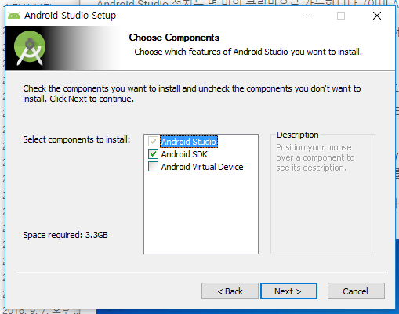
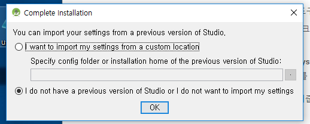

# 안드로이드 스튜디오 설치
Windows 기준..

## JDK 설치

- [JDK 다운로드 페이지](http://www.oracle.com/technetwork/java/javase/downloads/jdk8-downloads-2133151.html) 접속
- `Accept License Agreement` 체크하고 OS 버전에 맞는것을 클릭하여 다운받는다.
- Next가 있으면 누르면 된다.
- 끝

## Android Studio 설치

- [Android Stuido 다운로드 페이지](https://developer.android.com/studio/index.html) 접속
- 다운로드 버튼 클릭 - 약관 동의
- Next 클릭 후 `Android Virtual Device` 체크 해제 - Next  
 
- Android Studio와 SDK 경로 설정 - Next - Next
- 일단 설치가 다되면 Android Studio를 실행한다.
- I do not have a previous verison of Studio or I do not want to import my settings 체크하고 OK - Next
 
- Standard 선택하고 Next
- 끝
